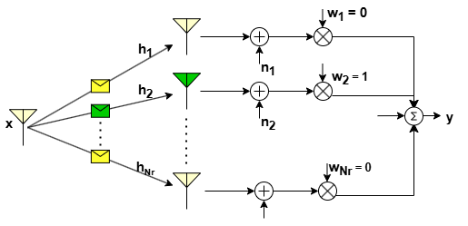
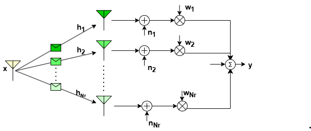
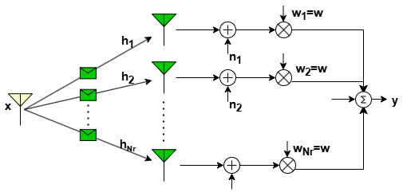

Spatial diversity is a crucial technique in telecommunications aimed at reducing signal fading and improving overall system performance. By deploying multiple antennas at either the transmitter (MISO), receiver (SIMO), or both (MIMO), spatial diversity enhances signal strength and reliability in wireless communication networks. A fundamental aspect of spatial diversity is the careful consideration of antenna spacing to ensure that the fading observed by each antenna is independent. This independence is essential for effectively combining the signals to avoid deep fade instances and thereby improve the communication reliability. Typically, antennas are spaced at intervals of $\frac{\lambda}{4}$, where $\lambda$ represents the wavelength of the transmitted signal. To harness the  spatial diversity via multiple antennas, it is crucial to employ an efficient combining technique at the receiver for SIMO system and beamforming technique at the transmitter for MISO system. These combining/beamforming techniques play a crucial role for exploiting spatial diversity, however they require the knowledge of the channel state information (CSI) and noise power. In the following, we provide a brief background on the various combining/beamforming techniques for SIMO and MISO systems.

# Receiver Diversity: SIMO
The combining can be done in several ways which vary in terms of design complexity and  performance gain. Most combining techniques are linear: the output of the combiner is just a weighted sum of the different (independent) fading paths or branches as shown in the figure below.

$$
\begin{aligned}
   \mathbf{y} = \left(\sum_{i=1}^{N_r} w_i \mathbf{h}_i\right) \mathbf{x}.
\end{aligned}
$$

Depending on the channel vector $\mathbf{h}$ (also called as CSI), different combining techniques select weight vector $\mathbf{w}$ (usually referred  as combiner or beamformer) to exploit spatial diversity effectively. These weights determine how signals from multiple antennas are combined to maximize the received signal quality.

There are two types of performance gain associated with receiver space diversity: 

1) Array gain: It represents the increase in signal strength obtained by using multiple antennas arranged in an array configuration. The array gain $A_g$ is defined as the increase in averaged combined SNR $\bar{\gamma}_c$ over the average branch SNR $\bar{\gamma}$, i.e.

$$
\begin{aligned}
   A_g = \frac{\bar{\gamma}_c}{\bar{\gamma}}
\end{aligned}
$$

2) Diversity order: The combining techniques exploits the spatial diversity to improve the received instantaneous SNR and thereby it enhance the bit error rate BER performance. The diversity order efficiently captures the improvement in BER performance for a given combining technique. Basically, diversity order  is a measure of the rate of decrease of the BER as a function of average branch SNR. Mathematically, for many systems, SER is given by,

$$
\begin{aligned}
   P_S \propto \gamma^{-d},
\end{aligned}
$$

where, $d$ is the diversity order.

Also, characterizing the outage performance becomes a crucial aspect for comparison of the various methods. Outage probability can be defined as the probability that the recieved signal power or the combined SNR $\gamma_c$ of the array is less than a certain pre-specified threshold $\gamma_0$, i.e.

$$
\begin{aligned}
   P_{out}(\gamma_0) = p(\gamma_c \leq \gamma_0).
\end{aligned}
$$

Lower outage probabilities indicate higher reliability and better performance under challenging channel conditions, such as fading, interference, and noise. The various combineing techniques are discussed below

## Selection Combining
Selection combining does not assign weights based on channel strengths but rather selects the signal with the highest instantaneous SNR among the received signals. Only the selected signal is further processed, while the others are discarded.

The above diagram illustrates selection combining wherein link gain $h_2$ observed by the second antenna in the array is highest. For this case,  received/selected signal in can be written as ${y} =  {h}_2{x}$, where $x$ is the transmitted symbol. In general, the received signal in selection combining is given by 

$$
\begin{aligned}
   {y} =  \left(\max_i|{h}_i|\right){x}.\nonumber
\end{aligned}
$$

The average combined SNR of the array for this technique is given as

$$
\begin{aligned}
   \bar{\gamma}_c = \sum \frac{\bar{\gamma}_i}{i}
\end{aligned}
$$

We can observe that the SNR gain increases with the number of receive antennas, but not linearly. Increasing the number of diversity branches from two to three will give much less gain than going from one to two.

 For a Rayleigh fading channel, the outage probability is derived as

$$
\begin{aligned}
   P_{out}(\gamma_o) = \left[1 - e^{-\frac{\gamma_0}{\bar{\gamma}}}\right]^{N_r} 
\end{aligned}
$$

## Maximal-Ratio Combining
Maximal Ratio Combining allocates weights to each received signal based on the strength of the corresponding channel coefficient in $\mathbf{h}$. $\mathbf{w}_i$'s assigned to each signal is proportional to its channel gain, aiming to maximize the signal power.

The received signal in MRC is given by

$$
\begin{aligned}
   y = \mathbf{w}^T\mathbf{h}x
\end{aligned}
$$

To maximize the received signal power, the optimal weight vector naturally becomes

$$
\begin{aligned}
   \mathbf{w}=\frac{\mathbf{h}}{\|\mathbf{h}\|}.
\end{aligned}
$$

The instantaneous combined SNR for this technique is given as

$$
\begin{aligned}
   \gamma_c = \frac{1}{N_0} \sum \| \mathbf{h}_i \|^2
\end{aligned}
$$

$$
\begin{aligned}
   \gamma_c = \sum \gamma_i
\end{aligned}
$$

where $N_0$ is the noise variance. Thus the avegare combined SNR becomes

$$
\begin{aligned}
   \bar{\gamma}_c=N_r\bar{\gamma}_i,
\end{aligned}
$$

From this, it can observed that array gain of MRC increases linearly with the number of receive antennas $N_r$.
For a Rayleigh fading channel, the outage probability is derived as

$$
\begin{aligned}
   P_{out}(\gamma_o) = 1-e^{-\frac{\gamma_0}{\bar{\gamma}}}\sum_{k=1}^{N_r}\frac{(\frac{\gamma_0}{\bar{\gamma}})^{k-1}}{(k-1)!}\nonumber
\end{aligned}
$$

## Equal gain Combining
Equal gain combining assigns equal weights to each received signal regardless of the channel coefficients' strengths. This technique simplifies the combining process

The received signal with EGC is given by

$$
   \mathbf{y} = \left(\sum_{i=1}^{N_r}\mathbf{h}_i\right)w\mathbf{x}.
$$

The array gain for this technique is given as

$$
\begin{aligned}
   \gamma_c = \frac{1}{N_0N_r}\left(\sum_{i=1}^{N_r} \mathbf{h}_i\right)^2.
\end{aligned}
$$

It can observed that array gain increases linearly with the number of receive antennas, $N_r$. However, performance is slightly less than MRC. This is the price paid for reduced complexity.
For a Rayleigh fading channel, the outage probability is derived as

$$
\begin{aligned}
   P_{out}(\gamma_o) = 1 -e^{-2\frac{\gamma_0}{\bar{\gamma}}}-\sqrt{\pi\frac{\gamma_0}{\bar{\gamma}}e^{-\frac{\gamma_0}{\bar{\gamma}}}}\left(1-2Q\left(\sqrt{\frac{2\gamma_0}{\bar{\gamma}}}\right)\right)
\end{aligned}
$$

# Transmit Diversity: MISO
When the channel state information is known at the transmitter, combining is done in a way similar to the SIMO using Selection combing, equal gain combining, and maximal ratio combining.
