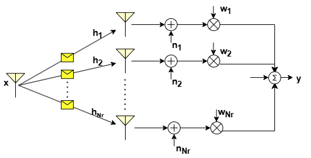

Spatial diversity is a crucial technique in telecommunications aimed at reducing the impact of channel fading and improving the quality of signal reception. By deploying multiple antennas at either the transmitter (i.e. MISO), receiver (i.e. SIMO), or both (i.e. MIMO), spatial diversity can be harnessed and utilized to enhance the signal strength  at the reciever which inturn can improve the communication performance. A fundamental aspect of spatial diversity is the careful consideration of antenna spacing to ensure that the fading observed by each antenna is independent. This independence is essential for ensuring the antennas do not experience deep fade simultaneously so that their signals can be effectively combined to avoid deep fade instances. For independent fading, the inter-antenna distance is typically selected as $\frac{\lambda}{4}$, where $\lambda$ represents the wavelength of the transmitted signal. To harness the  spatial diversity, it is crucial to employ an efficient combining technique at the receiver for SIMO system and beamforming technique at the transmitter for MISO system. These combining/beamforming techniques play a crucial role for exploiting spatial diversity, however they require the knowledge of the channel state information (CSI) and noise power. In the following, we provide a brief background on the various combining/beamforming techniques for SIMO and MISO systems.

# Receiver Diversity: SIMO
The recieve combining can be done in several ways which vary in terms of design complexity and  performance gain. Most combining techniques are linear: the output of the combiner is just a weighted sum of the different (independent) fading paths or branches as shown in the figure below.

The output of the combiner is given by 

$$
\begin{aligned}
   \mathbf{y} = \left(\sum_{i=1}^{N_r} w_i \mathbf{h}_i\right) \mathbf{x} + n.
\end{aligned}
$$

where $x$ is the transmitted symbol, $h_i$'s are the channel coefficients and $n$ is the noise.

Depending on the channel vector $\mathbf{h} = [h_1,h_2,...,h_{N_r}]$ (also called as CSI), the weight vector $\mathbf{w}$ (usually referred  as combiner or beamformer) is selected to exploit the spatial diversity effectively. These weights determine how signals from multiple antennas are combined to maximize the received signal quality.

There are three types of performance gain associated with receiver space diversity: 

1) Array gain $A_g$: It is defined as the increase in average combined SNR $\bar{\gamma}_c$ over the average branch SNR $\bar{\gamma}$, i.e.

$$
\begin{aligned}
   A_g = \frac{\bar{\gamma}_c}{\bar{\gamma}}.
\end{aligned}
$$

The array gain represents the increase in signal strength obtained by using multiple antennas arranged in an array configuration.

2) Diversity order $d$: It is a measure of the rate of decrease of the BER as a function of average branch SNR. For a given combiner, if the BER $P_b$ is such that 

$$
\begin{aligned}
   P_b \propto \gamma^{-d},
\end{aligned}
$$

then $d$ is the diversity order. The combining techniques exploits the spatial diversity to improve the received instantaneous SNR and thereby it enhance the bit error rate BER performance. The diversity order efficiently captures the improvement in BER performance for a given combining technique.

3) Outage probability $P_{out}$: It is defined as the probability that the recieved combined SNR $\gamma_c$ is less than a certain pre-specified threshold $\gamma_0$, i.e.

$$
\begin{aligned}
   P_{out}(\gamma_0) = p(\gamma_c \leq \gamma_0).
\end{aligned}
$$

Lower outage probabilities indicate higher reliability and better performance under challenging channel conditions, such as fading, interference, and noise. 

There are three commonly used combining techniques which are briefly described in the following. 

## Selection Combining
Selection combining does not assign weights based on channel strengths but rather selects the signal with the highest instantaneous branch SNR among the received signals. Only the selected signal is further processed, while the others are discarded as shown in the following figure.

The above figure illustrates selection combining wherein link gain $h_2$ observed by the second antenna in the array is the highest. For this case,  received/selected signal can be written as ${y} =  {h}_2{x}$, where $x$ is the transmitted symbol. In general, the received signal in selection combining is given by 

$$
\begin{aligned}
   {y} =  \left(\max_i|{h}_i|\right){x}.\nonumber
\end{aligned}
$$

The average combined SNR of the array for this technique is given as

$$
\begin{aligned}
   \bar{\gamma}_c = \sum \frac{\bar{\gamma}_i}{i}.
\end{aligned}
$$

We can observe that the array gain (combined SNR gain) increases with the number of receive antennas, but not linearly. In particular, with increase in number of branches $N_r$, the rate of gain diminishes. For instance, increasing the branches from 1 to 2 gives the gain of 0.5 and howvever, increasing from 2 to 3 gives the gain of 0.33. 

 For a Rayleigh fading channel, the outage probability is derived as [2]

$$
\begin{aligned}
   P_{out}(\gamma_o) = \left[1 - e^{-\frac{\gamma_0}{\bar{\gamma}}}\right]^{N_r} .
\end{aligned}
$$

## Equal gain Combining
Equal gain combining co-phases the signals across different branches i.e. $w_i=e^{-j\theta_i}$ where $\theta_i=\angle \mathbf{h}_i$ is the phase of the $i$-th branch. 

The received signal with EGC is given by

$$
   \mathbf{y} = \left(\sum_{i=1}^{N_r}\mathbf{h}_i w_i \right)\mathbf{x} = \left(\sum_{i=1}^{N_r}r_i\right)\mathbf{x},
$$

where $r_i=|\mathbf{h}_i|$.

The array gain for this technique is given as

$$
\begin{aligned}
   \gamma_c = \frac{1}{N_0N_r}\left(\sum_{i=1}^{N_r} \mathbf{r}_i\right)^2,
\end{aligned}
$$

where $N_0$ is the PSD of noise.

It can observed that array gain increases linearly with the number of receive antennas, $N_r$. However, performance is slightly less than MRC. This is the price paid for reduced complexity.

For a Rayleigh fading channel, the outage probability is derived as [2]

$$
\begin{aligned}
   P_{out}(\gamma_o) = 1 -e^{-2\frac{\gamma_0}{\bar{\gamma}}}-\sqrt{\pi\frac{\gamma_0}{\bar{\gamma}}e^{-\frac{\gamma_0}{\bar{\gamma}}}}\left(1-2Q\left(\sqrt{\frac{2\gamma_0}{\bar{\gamma}}}\right)\right)
\end{aligned}
$$

## Maximal-Ratio Combining (MRC)
Maximal Ratio Combining allocates weights to the received signals based on the channel coefficient in $\mathbf{h}$ such that it maximizes the instantaneous recieved SNR. 

The received signal in MRC is given by

$$
\begin{aligned}
   y = \mathbf{w}^T\mathbf{h}x
\end{aligned}
$$

The optimal weight vector (i.e MRC weights) that maximizes the instantaneous recieved SNR  is

$$
\begin{aligned}
   \mathbf{w}=\frac{\mathbf{h}}{\|\mathbf{h}\|}.
\end{aligned}
$$

The instantaneous combined SNR for this technique is given as

$$
\begin{aligned}
   \gamma_c = \frac{1}{N_0} \sum_{i=1}^{N_r} \| \mathbf{h}_i \|^2 = \sum \gamma_i
\end{aligned}
$$

Thus the average combined SNR becomes

$$
\begin{aligned}
   \bar{\gamma}_c=N_r\bar{\gamma}_i.
\end{aligned}
$$

For $\bar{\gamma_i} = \bar{\gamma}$, the array gain of MRC becomes $A_g = N_r$. It can be observed that MRCs array gain increases linearly with the number of antennas which is better when compared to the other combining techniques. Besides, it can also be noted that the combined SNR is the sum of individuaal branch SNRs which is also higher compared to other techniques.

For a Rayleigh fading channel, the outage probability is derived as [2]

$$
\begin{aligned}
   P_{out}(\gamma_o) = 1-e^{-\frac{\gamma_0}{\bar{\gamma}}}\sum_{k=1}^{N_r}\frac{(\frac{\gamma_0}{\bar{\gamma}})^{k-1}}{(k-1)!}\nonumber
\end{aligned}
$$

# Transmit Diversity: MISO
When the channel state information is known at the transmitter, combining can be done in a way similar to the SIMO system using one of the techniques such as  selection combing, equal gain combining, and maximal ratio combining which are discussed above.
